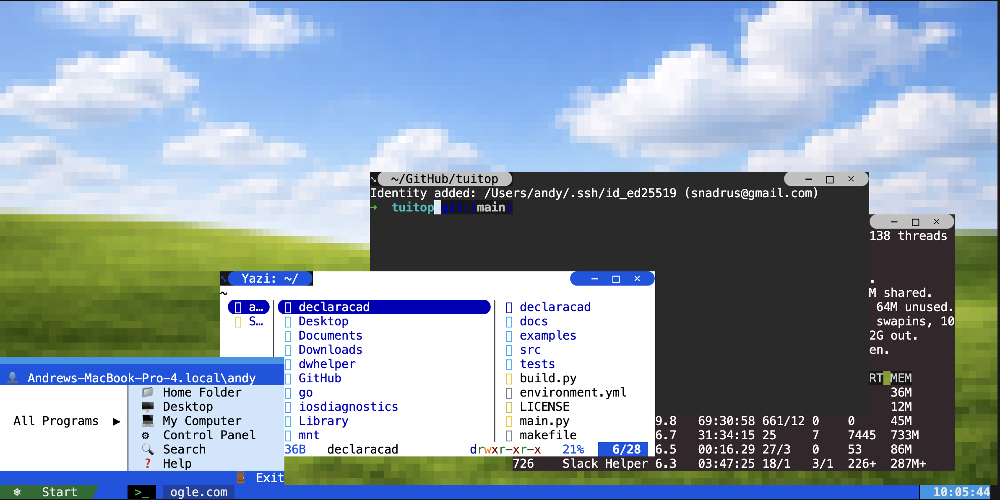

# tuitop — luxury terminal desktop

A full-screen terminal experience that feels less like a multiplexer and more like a polished desktop: Luna-era chrome, a photographic wallpaper rendered in the terminal, and a Start menu that launches a WinXP-skinned file manager.



## Highlights

- **True-color desktop wallpaper** —  Images scale to cover the viewport for a smooth, “luxury” backdrop behind your windows.
- **Windows XP–inspired chrome** — Classic blues and silvers to aligne with your favorite blocky UI.
- **Dedicated taskbar** — With a Start affordance, a one-click terminal launcher, buttons for minimized windows, and a live clock in the notification style. Mouse-driven: open the menu, spawn terminals, restore minimized panes.
- **Start menu** — Two-column layout with pinned shortcuts. **Home Folder**, **Desktop**, and **My Computer** open the [Yazi](https://github.com/sxyazi/yazi) file manager that matches the fantasy OS. **Exit** quits the app.
- **TUIOS underneath** — A forked [TUIOS](https://github.com/Gaurav-Gosain/tuios) provides PTY-backed windows and the usual window controls and a desktop flow with a text copy mode & mouse-wheel scrollback. 
- **Per-window atmosphere** — New terminals pick a random near-black background so stacked windows read as separate panes of glass over the wallpaper & avoid wasting your screen with borders
- **256-color fallback** — If your terminal mis-handles hex backgrounds on the taskbar or menu, set `TUITOP_USE_256_COLORS=1` (or `true`) for ANSI-256–approximated colors.

## Try it

Requires **Go 1.26+** (see `go.mod`) & Yazi. 

```bash
git clone https://github.com/snadrus/tuitop.git
cd tuitop
go run .
```

Use a modern terminal with **true color** and **mouse reporting** for the intended look. Resize the window to reflow the wallpaper and layout.

## Stack

[Bubble Tea v2](https://github.com/charmbracelet/bubbletea), [Lip Gloss v2](https://github.com/charmbracelet/lipgloss), [Ultraviolet](https://github.com/charmbracelet/ultraviolet) for cell-accurate composition, and the local TUIOS fork as the windowing/PTY engine.

## License / upstream

Tuitop is MIT licensed. Its major dependencies are too. Underlying Go libraries are public domain.

